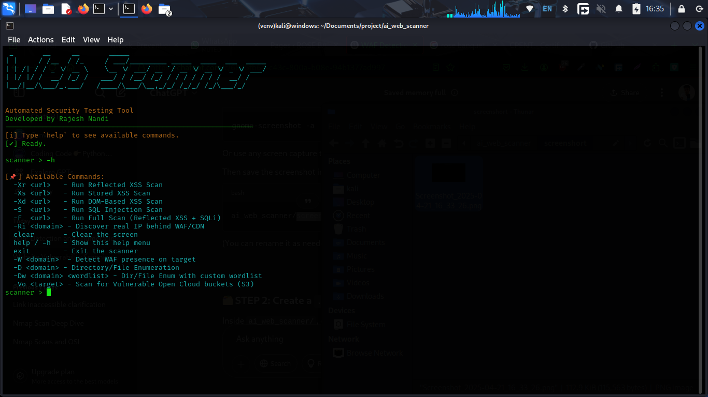
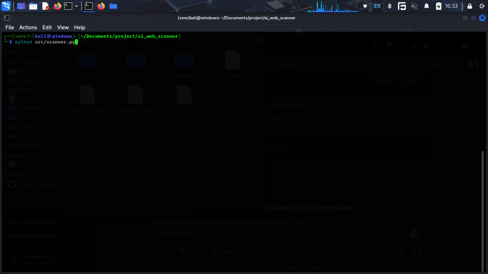

# 🛡️ Web Scanner

A powerful Python-based CLI tool for automating web security testing.  
**Web Scanner** helps ethical hackers and security professionals detect common web vulnerabilities like:

- 🔍 XSS (Reflected, Stored, and DOM-Based)
- 🧬 SQL Injection (Error-based, Boolean-based, Blind)
- 🛡️ WAF (Web Application Firewall) presence
- 📁 Directory/File Enumeration with progress meter
- 🌐 Real IP Detection behind CDNs like Cloudflare
- ☁️ Open cloud bucket misconfiguration scanning

---

## 📸 Screenshot

> Example: Scanning for WAF, Directories, SQLi and XSS

---

## ⚙️ Features

- ✅ Lightweight & Terminal-Based
- 🌈 Color-coded output using `termcolor`
- 🧵 Multi-threaded directory enumeration with `%` progress
- 📡 Discover origin IP behind Cloudflare/CDNs
- 🛡️ WAF fingerprinting via headers, responses & anomalies
- ☁️ S3 bucket enumeration for misconfigured cloud storage
- 🔐 CLI-friendly for quick recon and testing

---

📖 Command Reference
Command	Description
-Xr <url>	Run Reflected XSS Scan
-Xs <url>	Run Stored XSS Scan
-Xd <url>	Run DOM-Based XSS Scan
-S <url>	Run SQL Injection Scan
-F <url>	Run Full Scan (Reflected XSS + SQLi)
-Ri <domain>	Discover real IP behind WAF/CDN
-W <domain>	Detect WAF presence on target
-D <domain>	Run Directory/File Enumeration using default wordlist
-Dw <domain> <wordlist>	Run Dir/File Enum with a custom wordlist
-Vo <target>	Scan for Vulnerable Open Cloud (S3) Buckets
clear	Clear the screen
help / -h	Show this help menu
exit	Exit the scanner
📦 Requirements

    Python 3.8+

    requests

    termcolor

    selenium

    dnspython

    ipwhois

    Google Chrome + Chromedriver

👨‍💻 Author

Rajesh Nandi
🚀 CEH v12 | 🛠️ Web Developer | 🧪 Cybersecurity Enthusiast
📫 LinkedIn →

    ⚠️ Disclaimer: This tool is for educational and authorized security testing only. Never scan targets without proper permission.
    
---

### ✅ What Changed:
- Commands now **exactly match** your `-h` output
- Clear descriptions for each flag
- Better formatting for ease of reading

Let me know if you'd like:
- A dark-mode or terminal-themed screenshot to go with this
- Shields.io badges (like Python version, license, etc.)
- A GitHub profile README next for your portfolio!
